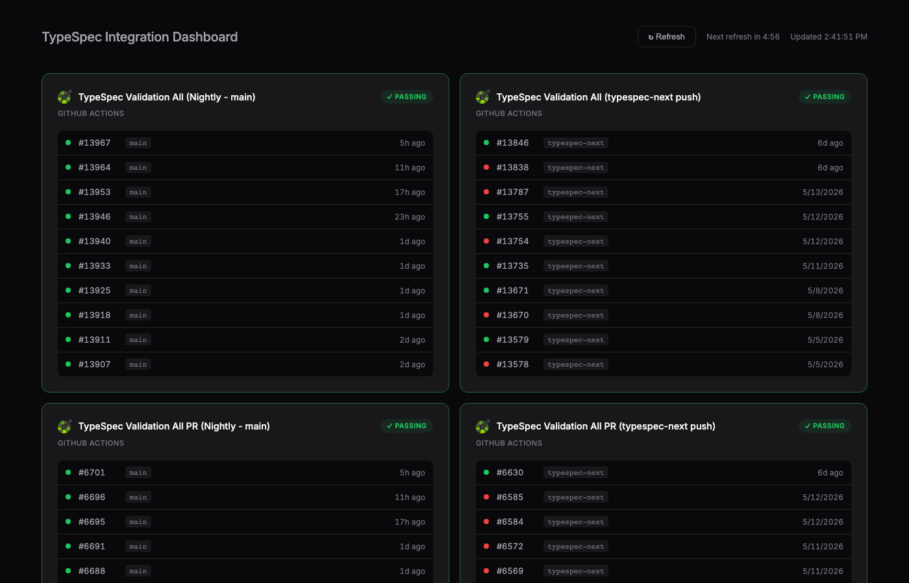

# TypeSpec Integration Dashboard

A CLI tool and local web dashboard to monitor nightly CI pipelines testing TypeSpec across GitHub Actions and Azure DevOps.

## CLI Output

```
  TypeSpec Integration Status
  ───────────────────────────────────────────────────────────────────────────
  ● TypeSpec Validation All (Nightly - main)          10/10  passing    go to ↗
  ● TypeSpec Validation All (typespec-next push)       5/10  passing    go to ↗
  ● TypeSpec Validation All PR (Nightly - main)       10/10  passing    go to ↗
  ● TypeSpec Validation All PR (typespec-next push)    1/10  passing    go to ↗
  ● Autorest Python Nightly                            7/10  passing    go to ↗
  ● Autorest TypeScript Nightly                       10/10  passing    go to ↗
  ● typespec-java nightly dev                          9/10  passing    go to ↗
  ● Autorest Go Nightly                                8/10  passing    go to ↗
  ───────────────────────────────────────────────────────────────────────────
  Use --open to launch the local dashboard in your browser.
```

Pipeline names are clickable hyperlinks in supported terminals (iTerm2, VS Code, Windows Terminal).

## Web Dashboard



## Pipelines Monitored

| Pipeline | Source | Language |
|----------|--------|----------|
| TypeSpec Validation All (Nightly - main) | GitHub Actions | OpenAPI |
| TypeSpec Validation All (typespec-next push) | GitHub Actions | OpenAPI |
| TypeSpec Validation All PR (Nightly - main) | GitHub Actions | OpenAPI |
| TypeSpec Validation All PR (typespec-next push) | GitHub Actions | OpenAPI |
| Autorest Python Nightly | Azure DevOps | Python |
| Autorest TypeScript Nightly | Azure DevOps | TypeScript |
| typespec-java nightly dev | Azure DevOps | Java |
| Autorest Go Nightly | Azure DevOps | Go |

## Quick Start

```bash
npx github:timotheeguerin/typespec-integration-dashboard
```

That's it. Requires `gh` CLI authenticated (`gh auth login`) and Node.js 20+.

To open the web dashboard:

```bash
npx github:timotheeguerin/typespec-integration-dashboard --open
```

## Development Setup

```bash
pnpm install
pnpm run build
```

## Usage (from source)

### CLI (terminal summary)

```bash
node dist/index.js
```

Shows a colored summary of all pipeline statuses with pass rates. Exits with code 1 if any pipeline's latest run is failing.

### Web Dashboard

```bash
node dist/index.js --open
```

Starts a local server at `http://127.0.0.1:3927` and opens the dashboard in your browser. The dashboard auto-refreshes every 5 minutes and shows the last 10 runs per pipeline with status indicators.

The local server uses your `gh` CLI token to authenticate with GitHub, enabling access to private repos (like `azure-rest-api-specs-pr`).

## How It Works

- **GitHub token**: Obtained automatically via `gh auth token`
- **ADO access**: Public project APIs, no auth needed
- **Shared code**: Pipeline config and API fetchers are shared between CLI and web (`src/pipelines.ts`, `src/fetchers.ts`)
